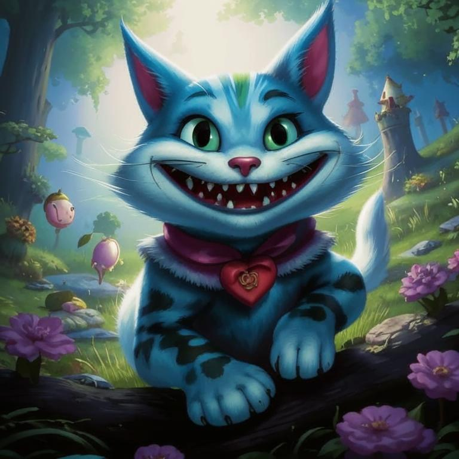

# Обо мне

Я &mdash; **загадка**, окутанная тайной, улыбкой и туманом. Появляюсь неожиданно, 
когда никто меня не ждет, и исчезаю так же внезапно, оставляя лишь лёгкий след
своей таинственной ухмылки. Мои глаза сверкают озорством, а хвост, словно 
живая змея, всегда готов к новым приключениям.

Моя _сущность_ &mdash; это игра теней и света, иллюзий и реальности. Я живу в мире,
где логика подчиняется фантазии, а здравый смысл уступает место абсурду. 
Мой смех звучит эхом среди деревьев, заставляя сердца трепетать от 
предвкушения неизвестного.

Но за моей весёлостью скрывается глубокое знание мира. Я вижу то, что скрыто
от глаз других, и понимаю вещи, недоступные разуму простых смертных.
Моя мудрость &mdash; это не просто знания, но умение видеть суть вещей, находить
ответы там, где их нет.

Я &mdash; [символ свободы и непокоренности](https://ru.wikipedia.org/wiki/%D0%9A%D0%B0%D1%82%D0%B5%D0%B3%D0%BE%D1%80%D0%B8%D1%8F:%D0%A1%D0%B8%D0%BC%D0%B2%D0%BE%D0%BB%D1%8B_%D1%81%D0%B2%D0%BE%D0%B1%D0%BE%D0%B4%D1%8B).
Никто не может удержать меня, заставить следовать правилам или жить по чужим
законам. Я сам себе хозяин, и мой путь &mdash; это танец между реальностью и 
фантазией, между жизнью и смертью.

Так что помни, ~~маленький~~ друг: когда тебе кажется, что все потеряно, 
и мир рушится вокруг тебя, возможно, именно тогда я появлюсь, чтобы напомнить
тебе о том, что чудеса ещё существуют. И даже если я исчезну, оставив после
себя лишь свою улыбку, знай &mdash; я всегда буду рядом, готовый помочь тебе
найти свой путь в этом странном и удивительном мире.

